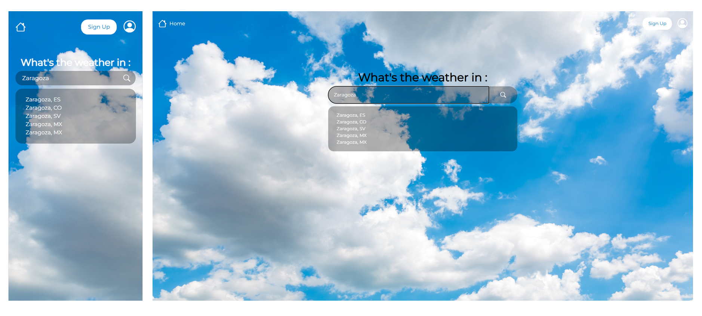

# Weather Application

A beginner-friendly weather application that leverages OpenWeatherMap API to deliver real-time weather data with an intuitive user experience. The project focuses on integrating frontend and backend technologies while implementing database functionality and user account management for a dynamic and personalized application.

## Core Features 

- RESTful API integration 
- Backend data handling 
- Search with autocompletion

## Future Improvements 

- Database integration (_work in progress_)
- User account system (_work in progress_)
- Favorite cities management

## Tips

You can find the database I made in the "00_readme" folder and import it to try it.

## 🧰 Tool Box for this project

## 📸 Screenshots

## 🍞 About Me
Hi everyone, I'm Madame R. a Web Developer from France. 
Currently in training, I'm a database enthusiast.
Enjoy your stay, have a look at my other repositories and let's get in touch if you wish to work with me.

## 🛠️ Tech Stack

**Database:** MySQL, Doctrine ORM

**Back End:** PHP, Symfony

**Front End:** HTML, CSS, Javascript, React

**IDE:** Visual Studio Code

**Versioning:** Git, Github

## ❤️ Acknowledgements

- [OpenWeatherMap Team for their API ](https://openweathermap.org/)
- [Random City Team for names to test](https://randomcity.net/)

## 📃 License

